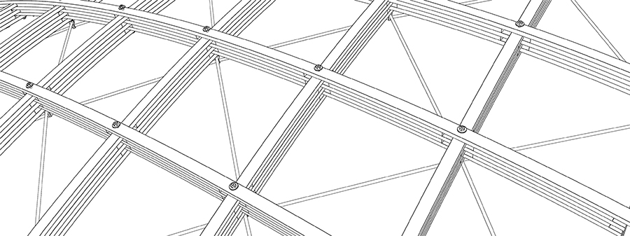

# Semana 1: Introducción a las Estructuras Complejas

Este curso tiene como objetivo edentrárte en las estructuras complejas.

## ¿Qué son las estrucutras complejas?

* Definimos las estructuras complejas como aquellas estructuras arquitectónicas cuya resistencia proviene fundamentalmente de su forma y no de su masa.
* A lo largo de tu carrera, haz estudiado estructuras de acero, de concreto, de mampostería, pero fundamentalmente haz estudiado estructuras de __poste y dintel__. Estas estructuras utilizan fundamentalmente muros de carga y columnas verticales, y trabes y losas perfectamente horizontales, sin embargo, existen muchos otros tipos de estructuras y comportamientos estructurales.
* Podemos definir a las estructuras complejas como aquellas estructuras cuyo comportamiento estructural está íntimamente relacionado con su forma.

## ¿Qué tipos de estructuras complejas hay?

* En este curso, estudiaremos distintos tipos de estructuras complejas como __arcos y bóvedas__, __estructuras suspendidas__, __tensoestructuras__ y __cascarones__.[^1] Cada una de estas estructuras tiene un comportamiento estructural distinto de las trabes y columnas que ya sabes diseñar, calcular, y analizar.
* He preparado un micrositio con ejemplos de estrucutras complejas que me gustan mucho por muchas diferentes razones. Revisa bien la página y el contenido, e investiga un poco sobre los proyectos que se muestran, ya que haremos preguntas sobre ellos en el cuestionario de esta semana. Para acceder al micrositio haz click en la siguiente liga. ¡No olvides regresar al esta página después para responder el cuestionario!      
[Ir al micrositio](https://rshiordia.github.io/Complex-Geometry/){ .md-button }

## ¿Qué hay en el micrositio?

* En el microstio has visto 5 obras de arquitectos importantes que utilizan superficies curvas, arcos, bóvedas, y en general son estructuras no tradicionales cuya forma es fundamental en el entendimiento y comportamiento de la estructura. Haz clock en los links para revisar modelos tridimensionales interactivos.
* El [auditorio Kresge](https://www.shapediver.com/app/models/auditorio-kresge) de Eero Saarinen es una bóveda esférica. Esta geometría ayuda a cubrir el espacio sin el uso de apoyos centrales.
* Shigeru Ban, en el [gimnasio Atsushi](https://www.shapediver.com/app/models/atsushi-imai), usa un domo elipsoidal para librar un claro de 30 metros. ¿Te imaginas si esto estuviera resuelto con una trabe de concreto? ¿Qué peralte tendría?
* En la [estación de Waterloo](https://www.shapediver.com/app/models/waterloo-station), Nicholas Grimshaw utiliza arcos para trazar y construir armaduras tridimensionales para la estación de tren. El uso de esta geometría, no sólo permite librar el claro, sino adaptar la forma en planta de la estación al trazo de la vía de tren.
* Los [domos geodésicos](https://www.shapediver.com/app/models/trazo-geodesico) de Buckminster Fuller, utilizan triangulaciones para lograr estructuras rígidas. 

### Siguientes pasos
* una vez que termines de revisar la información de esta página, deberás contestar el primer cuestionario.   
[Ir al cuestionario.](https://forms.microsoft.com/Pages/ResponsePage.aspx?id=l2uNDV3gDEa2tRm30CD0eqDlmO97gQdBovZv0Skd3ZlURE1BTzNWRTRGVlZWOFVYRjU0TVhVNlI4WS4u){ .md-button }

[^1]: Estos son ejemplos de las estructuras que aprenderemos a calcular y analizar, pero existen más tipos de estructuras complejas.

[Siguiente](./s2.md){ .md-button }
