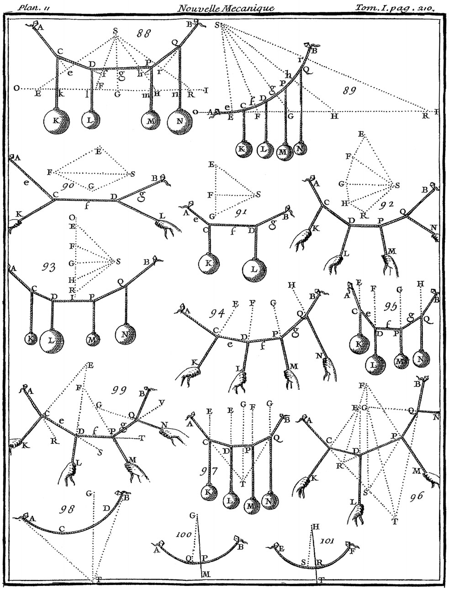

# Semana 2: Estática Gráfica

Para poder analizar y calcular las estructuras complejas que veremos en este curso, usaremos el método gráfico.   
La estática gráfica es un método muy efectivo para visualizar y calcular las estructuras por medio del trazo geométrico que nos permite el entendimiento de la forma y las fuerzas de un sistema.
La Estática Gráfica nos permite trazar las fuerzas que actúan en un sistema, y relacionarlas

## Un poco de Historia
{ align=center }  

* Los primeros estudios al respecto fueron realizados por Leonardo da Vinci y Galileo Galilei.
* Simon Stevin (1548-1620) fué la primera persona en representar una fuerza como un vector.
* Isaac Newton (1642-1727) formuló las leyes de las fuerzas que gobiernan la estática que es el estudio de los cuerpos en reposo y su hermana, la dinámica, que estudia los cuerpos en movimiento.
* Verignon (1654-1722) en 1725 presentó el polígono funicular en un trabajo.
* En 1748 Giovanni Poleni presentó un análisis gráfico de la cúpula de la basílica de San Pedro en Roma. El análisis de Poleni incluía el análisis de un modelo de cadena colgante para comprender la trayectoria de las fuerzas de empuje en la bóveda.
* Antoni Gaudí, Famosamente, utiliza modelos de cadenas colgantes para diseñar su obra maestra, la Sagrada Familia.
* Eduardo Torroja, y Félix Candela (1910-1997), fueron educados en el uso de la Estática Gráfica en España.
* El arquitecto Juan Antonio Tonda Magallón (1931-2016), socio de Féliz Candela en diversos proyectos, enseñó y usó el método en México en la Escuela Nacional de Arquitectura.
* El arquitecto José Luis Rincón (n. 1944), enseña el método hoy en día en la Especialidad en Diseño de Cubiertas Ligeras de la Facultad de Arquitectura en la UNAM.

## Lectura 1: Form and Forces

* Para terminar el trabajo de esta semana, es necesario que leas la primera lectura en el curso de Perusall.
* Deberás ingresar a Perusall y crear tu cuenta con tu correo institucional y contestar las preguntas que he puesto en la lectura.
* Una vez que hayas creado tu cuenta Perusall, podrás acceder al curso con el código `SHIORDIA-LOPEZ-EJG9K`

[Siguiente](./s3.md){ .md-button }
