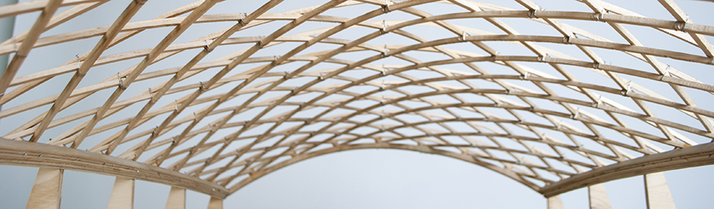

# Estructuras Complejas

Bienvenido al curso de estructuras complejas de otoño 2023 en la Universidad Anáhuac México.
Este curso es un curso en línea @prende y estará en esta página durante todo el semestre. Cada semana tendremos una pequeña interacción y una tarea para poder ir siguiendo tu progreso.

## Estructura del Curso

* Cada semana tendremos contenido nuevo que tendrás que revisar en este sitio.
* Cuando termines de estudiar el material de la semana, tendrás que entregar una tarea referente al tema de la semana.
* Los módulos de cada semana tendrán la información del tema, ligas de interés y el vpinculo para entregar la tarea.
* Además de las tareas de cada semana, existirá un proyecto semestral que deberás de ir desarrollando durante el curso. Puede ser que las tareas estén relacionadas al proyecto final.
* La evaluación de medio términao será un examen teórico/práctico en línea.

## Acerca de

- Este curso es para alumnos y alumnas de la Universidad Anáhuac México.
- Puedes revisar el calendario del curso en [esta página](./calendario.md)

### Empieza por aquí.

- [Conéctate al servidor de discord](https://discord.gg/uzQ73Jm9){ .md-button }
- [Mándame un correo](mailto:rodrigo.shiordia@anahuac.mx){ .md-button }
- [¡Empezar el curso!](./Contenido%20Semanal/s1.md){ .md-button }
